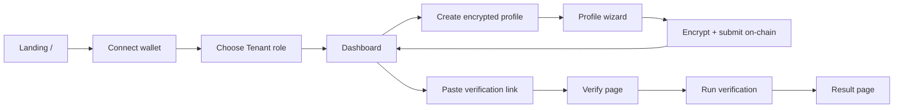
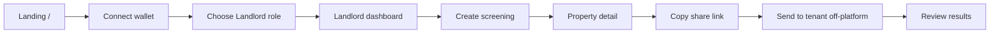

# Tr*st.it — Product Requirements Document

**Version:** 1.0  
**Last updated:** June 6, 2026  
**Status:** MVP (live on testnet)

---

## 1. Executive Summary

**Tr*st.it** is a confidential rental screening platform that lets tenants prove they meet a landlord's eligibility criteria **without revealing their underlying financial data**.

Tenants create a reusable, encrypted profile (monthly salary, credit score, employment duration). Landlords define screening requirements for a property (rent, income multiplier, minimum credit, minimum tenure). When a tenant runs a verification, the system compares encrypted values against plaintext thresholds on-chain using **Fhenix CoFHE** (Fully Homomorphic Encryption) and returns only **pass/fail booleans** plus an overall eligibility verdict.

**Tagline:** *Prove you qualify. Without revealing why.*

---

## 2. Problem Statement

### 2.1 Tenant pain

- Rental applications require sharing sensitive financial data (salary, credit score, employment history) with every landlord.
- Repeated disclosure increases privacy risk and application fatigue.
- Tenants often do not know exactly what landlords will see or how close they are to failing a requirement.

### 2.2 Landlord pain

- Screening is fragmented: requirements are communicated informally, and proof is inconsistent.
- Landlords need a binary answer ("does this applicant qualify?") without needing raw numbers that create liability and bias risk.
- Traditional screening tools expose more PII than necessary.

### 2.3 Market gap

No widely available rental screening flow combines:

1. **Reusable tenant credentials** (one profile, many verifications)
2. **Threshold-only disclosure** (pass/fail, not magnitudes)
3. **Cryptographic enforcement** of privacy (not just policy promises)

Tr*st.it fills this gap using wallet-based identity, encrypted on-chain profiles, and FHE-powered comparisons.

---

## 3. Target Users & Personas

### 3.1 Tenant (primary)

| Attribute | Detail |
| --- | --- |
| **Goal** | Qualify for rentals without repeatedly exposing salary, credit, and employment details |
| **Behavior** | Connects wallet once, builds encrypted profile, pastes landlord verification links |
| **Technical comfort** | Comfortable with Web3 wallets (MetaMask, WalletConnect-compatible wallets) |
| **Success** | Receives clear pass/fail results; landlords never see raw numbers |

### 3.2 Landlord (primary)

| Attribute | Detail |
| --- | --- |
| **Goal** | Screen applicants against objective criteria with minimal PII exposure |
| **Behavior** | Creates property screenings, shares verification links off-platform, reviews applicant outcomes |
| **Technical comfort** | Basic wallet usage; no FHE knowledge required |
| **Success** | Sees eligible/not-eligible verdicts per applicant without accessing underlying financial data |

### 3.3 Viewer (secondary)

Any party with a result link can view pass/fail outcomes. They cannot see encrypted profile values. Result pages are accessible by URL (no strict auth gate on `/results/[id]`).

---

## 4. Product Goals & Success Metrics

### 4.1 Goals

| # | Goal |
| --- | --- |
| G1 | Enable tenants to verify eligibility against landlord thresholds without plaintext disclosure |
| G2 | Give landlords a simple screening workflow: create request → share link → review results |
| G3 | Enforce privacy cryptographically via CoFHE, not only via application policy |
| G4 | Provide a reusable encrypted profile that works across multiple landlord requests |
| G5 | Deliver a polished, role-aware UX with clear privacy messaging |

### 4.2 Success metrics (MVP)

| Metric | Definition | Target (MVP) |
| --- | --- | --- |
| Profile completion rate | % of onboarded tenants who submit an encrypted profile | > 60% |
| Verification completion rate | % of verify-page visits that result in a recorded result | > 40% |
| End-to-end verification latency | Time from "Run verification" click to result page | < 60s (median) |
| Privacy incidents | Raw profile values exposed in Convex, logs, or UI | 0 |
| Role lock integrity | Cross-role access attempts blocked | 100% |

---

## 5. Scope

### 5.1 In scope (MVP)

- Wallet-based authentication (Reown AppKit / WalletConnect v2)
- Permanent role selection (tenant or landlord), locked per wallet
- Tenant encrypted profile creation and editing (salary, credit, employment)
- Landlord property screening creation with shareable verification links
- FHE on-chain verification via `TrstItVerifier` smart contract
- Pass/fail result storage and display for both parties
- Tenant dashboard with verification history and link-paste modal
- Landlord dashboard with stats, properties list, per-property detail, and aggregated results
- Dark/light theme support
- INR and USD currency display for rent and income thresholds
- Employment duration buckets for tenant input and landlord minimums

### 5.2 Out of scope (MVP)

| Feature | Rationale |
| --- | --- |
| Property marketplace / listings | Screening-only product; no discovery layer |
| In-app messaging | Links shared off-platform |
| Payments / deposits | Not part of screening flow |
| Reviews / ratings | Future social layer |
| Real-world KYC / credit bureau integrations | MVP uses self-reported values |
| Verifiable attestations (employer, bank, payroll) | Roadmap item |
| Request templates | Manual per-property creation only |
| Push/email notifications | No notification infrastructure |
| Multi-unit portfolio management beyond basic property cards | Minimal property model |
| Expiring requests or results | No TTL enforcement yet |
| Mobile-native apps | Responsive web only |

---

## 6. User Journeys

### 6.1 First-time tenant journey



1. Visit `/` → connect wallet via Reown AppKit
2. Select **Tenant** role (locked permanently to wallet)
3. Land on `/dashboard` → prompted to create encrypted profile
4. Complete `/profile` wizard: salary → credit → employment → review → encrypt
5. Profile encrypted client-side (`cofhejs`), submitted to `TrstItVerifier.submitProfile()` on-chain; ciphertext handles mirrored to Convex
6. Receive verification link from landlord (off-platform)
7. Paste link on dashboard or open `/verify/[shareSlug]` directly
8. Review requirements → click **Run verification**
9. View `/results/[resultId]` with per-requirement pass/fail and overall verdict

### 6.2 First-time landlord journey



1. Visit `/` → connect wallet → select **Landlord** role
2. Land on `/landlord` → onboarding or dashboard with stats
3. Create screening at `/landlord/requests/new`: property name, optional label, rent, income multiplier, min credit, min employment
4. Redirected to `/landlord/requests/[requestId]` with shareable link
5. Copy `/verify/[shareSlug]` and send to applicant
6. Review applicants on property detail page or `/landlord/results`

### 6.3 Re-verification journey

If a tenant has already verified against a request:

- Verify page shows existing result with **View result** and **Re-run** options
- Re-run overwrites the prior Convex result (same `requestId` + `tenantAddress` pair)
- Useful when tenant updates their encrypted profile

---

## 7. Functional Requirements

### 7.1 Authentication & identity

| ID | Requirement | Priority |
| --- | --- | --- |
| AUTH-01 | Users authenticate exclusively via Ethereum-compatible wallets | P0 |
| AUTH-02 | Wallet address (lowercased) is the canonical user identifier | P0 |
| AUTH-03 | No email, password, or traditional account system | P0 |
| AUTH-04 | App supports Arbitrum Sepolia (default) and Ethereum Sepolia via `NEXT_PUBLIC_CHAIN_ID` | P0 |
| AUTH-05 | Users must switch to the active chain before on-chain operations | P0 |

### 7.2 Onboarding & role management

| ID | Requirement | Priority |
| --- | --- | --- |
| ROLE-01 | On first connect, user must choose **Tenant** or **Landlord** | P0 |
| ROLE-02 | Role is permanently locked to wallet; changing role throws server error | P0 |
| ROLE-03 | Role selection available on `/` (landing) and `/onboarding` | P0 |
| ROLE-04 | `RoleGuard` component enforces role on protected routes; wrong role redirects to correct dashboard | P0 |
| ROLE-05 | Unregistered wallets accessing protected routes redirect to `/onboarding` | P0 |
| ROLE-06 | Landing page supports `?role=landlord` query param to pre-select landlord | P1 |

### 7.3 Tenant encrypted profile

| ID | Requirement | Priority |
| --- | --- | --- |
| PROF-01 | Profile wizard steps: intro → salary → credit → employment → review → encrypting → success | P0 |
| PROF-02 | Salary: integer input, currency auto-detected (INR for India locale, USD for US, default INR) | P0 |
| PROF-03 | Salary range: 0 – 10,000,000 | P0 |
| PROF-04 | Credit score range: 300 – 900 (UI); stored as encrypted integer; contract uses 0–850 validation on landlord side | P0 |
| PROF-05 | Employment: bucket selection mapping to representative months (3, 9, 18, 42, 72) | P0 |
| PROF-06 | Values encrypted client-side via `@cofhe/sdk` before any network transmission | P0 |
| PROF-07 | Encrypted values submitted on-chain via `submitProfile(salary, credit, employment)` | P0 |
| PROF-08 | Ciphertext handles + metadata stored in Convex `profiles` table (no plaintext) | P0 |
| PROF-09 | Profile is editable; updates overwrite prior on-chain profile and Convex record | P0 |
| PROF-10 | Encrypting step shows per-field progress animation (salary, credit, employment) | P1 |
| PROF-11 | Wrong-chain warning with chain-switch action before submission | P0 |

### 7.4 Landlord screening requests

| ID | Requirement | Priority |
| --- | --- | --- |
| REQ-01 | Landlord creates screening with: property name (required), property label (optional), monthly rent, currency (INR/USD), salary multiplier, min credit score, min employment months | P0 |
| REQ-02 | Required income computed as `monthlyRent × salaryMultiplier`; displayed as threshold to tenant | P0 |
| REQ-03 | Validation: rent > 0, multiplier > 0, credit 0–850, employment months ≥ 0 | P0 |
| REQ-04 | System generates 14-character unguessable `shareSlug` per request | P0 |
| REQ-05 | Share URL format: `/verify/[shareSlug]` | P0 |
| REQ-06 | Only wallets registered as landlord can create requests (server-enforced) | P0 |
| REQ-07 | Landlord employment minimums: 6, 12, 24, or 60 months (bucket labels) | P0 |
| REQ-08 | Property detail page shows requirements, share link (copy), and applicant list | P0 |
| REQ-09 | Properties list page shows all screenings with applicant/eligible counts | P0 |

### 7.5 Verification execution

| ID | Requirement | Priority |
| --- | --- | --- |
| VER-01 | Tenant opens `/verify/[shareSlug]` to view landlord requirements before running | P0 |
| VER-02 | Requirements displayed: min monthly income, min credit score, min employment (plaintext thresholds only) | P0 |
| VER-03 | Sidebar explains what landlord will and will not see | P0 |
| VER-04 | Prerequisites enforced: wallet connected, tenant role, profile exists, correct chain | P0 |
| VER-05 | "Run verification" triggers on-chain `verify(minSalary, minCredit, minEmployment)` | P0 |
| VER-06 | Only the profile owner (msg.sender) can verify their own profile (contract-enforced) | P0 |
| VER-07 | Contract computes three `FHE.gte` comparisons on encrypted profile vs plaintext thresholds | P0 |
| VER-08 | Boolean results decrypted off-chain via Fhenix Threshold Network | P0 |
| VER-09 | Decrypted booleans published on-chain via `publishVerificationResult` with threshold signatures | P0 |
| VER-10 | Frontend polls until `readVerification` returns `ready: true` | P0 |
| VER-11 | Result recorded in Convex with pass/fail per dimension + `overallEligible` (AND of all three) | P0 |
| VER-12 | Progress phases shown: initializing → submitting → decrypting → saving → done | P1 |
| VER-13 | Invalid slug shows "Verification not found" empty state | P0 |
| VER-14 | Re-run allowed; overwrites existing result for same tenant + request | P1 |

### 7.6 Results & reporting

| ID | Requirement | Priority |
| --- | --- | --- |
| RES-01 | Result page `/results/[resultId]` shows per-requirement pass/fail and overall eligibility | P0 |
| RES-02 | Result page shows property context (name, identifier) and evaluation timestamp | P0 |
| RES-03 | Result page identifies viewer role: tenant, landlord, or anonymous viewer | P1 |
| RES-04 | Tenant dashboard lists verification history with eligibility badges and links to results | P0 |
| RES-05 | Tenant can paste verification link via modal (accepts full URL or slug) | P0 |
| RES-06 | Landlord dashboard shows aggregate stats: active properties, total/eligible/pending/failed applicants | P0 |
| RES-07 | Landlord results page aggregates all applicant outcomes across properties, sorted by date | P0 |
| RES-08 | Per-property detail lists applicants with wallet address (truncated) and eligibility status | P0 |
| RES-09 | Convex stores only booleans in `results` — never proximity-to-threshold or raw values | P0 |

### 7.7 Navigation & chrome

| ID | Requirement | Priority |
| --- | --- | --- |
| NAV-01 | Header hidden on landing page; shown on all other routes | P1 |
| NAV-02 | Tenant nav: Dashboard, Profile | P0 |
| NAV-03 | Landlord nav: Dashboard, Properties, Results | P0 |
| NAV-04 | Theme toggle (dark/light) available in header and landing | P1 |
| NAV-05 | Wallet connect button in header on non-landing pages | P0 |

---

## 8. Privacy & Security Requirements

### 8.1 Privacy guarantees

| Guarantee | Implementation |
| --- | --- |
| Raw values never leave device in plaintext | Client-side encryption via `cofhejs` before on-chain submission |
| Encrypted profile stored on-chain | `TrstItVerifier` holds `euint64` salary, `euint32` credit, `euint32` employment |
| Only booleans decrypted | FHE comparisons produce `ebool`; threshold network decrypts booleans only |
| No magnitude leakage in database | Convex `results` stores pass/fail flags only, not distances from threshold |
| Self-verify only | Contract `verify()` requires `msg.sender` to own the profile |
| Role isolation | Server-side mutations validate user role before writes |

### 8.2 Data classification

| Data | Storage | Sensitivity |
| --- | --- | --- |
| Wallet address | Convex `users`, `profiles`, `requests`, `results` | Pseudonymous identifier |
| Encrypted ciphertext handles | Convex `profiles` + on-chain contract | Encrypted (not plaintext PII) |
| Landlord thresholds | Convex `requests` (plaintext) | Low — intentionally public to applicants |
| Verification booleans | Convex `results` + on-chain after publish | Low — designed for disclosure |
| Raw salary/credit/employment | On-chain ciphertext only | High — never decrypted in MVP flow |

### 8.3 Security requirements

| ID | Requirement |
| --- | --- |
| SEC-01 | Environment variables for contract address, Convex URL, Reown project ID — never committed |
| SEC-02 | Share slugs must be cryptographically random (14 chars) to prevent enumeration |
| SEC-03 | Convex mutations validate role and ownership before data writes |
| SEC-04 | Contract validates threshold network signatures on `publishVerificationResult` |
| SEC-05 | No server-side storage of private keys |

### 8.4 Known MVP limitations

- **Self-reported values:** Tenants enter their own salary, credit, and employment. There is no third-party attestation or fraud prevention beyond cryptographic privacy.
- **Result link sharing:** Anyone with a result URL can view pass/fail outcomes (walletAddress of tenant is visible).
- **No request expiration:** Verification links remain valid indefinitely.
- **No rate limiting:** On-chain verification is gated by gas, not application-level throttling.

---

## 9. Technical Architecture

### 9.1 Stack

| Layer | Technology |
| --- | --- |
| Frontend | Next.js 14 (App Router), React 18, TypeScript, Tailwind CSS, Framer Motion |
| Backend / DB | Convex (real-time queries, mutations, schema) |
| Wallet | Reown AppKit 1.8 + wagmi 2.19 + viem 2.45 |
| FHE client | `@cofhe/sdk` 0.6 (web + core) |
| On-chain | `TrstItVerifier.sol` on Arbitrum Sepolia or Ethereum Sepolia |
| Contract tooling | Hardhat, ethers 6, OpenZeppelin, Fhenix CoFHE contracts |

### 9.2 System diagram

```
┌──────────────┐    encrypted profile     ┌──────────────────────┐
│ Tenant       │ ───────────────────────► │ TrstItVerifier (FHE) │
│ Browser      │                          │ on Arbitrum Sepolia  │
│ (cofhejs)    │ ◄── async decrypt of ─── │                      │
│              │     booleans only        └──────────────────────┘
└──────┬───────┘
       │ booleans + metadata
       ▼
┌──────────────┐                           ┌──────────────┐
│ Convex DB    │ ◄──────── reads ───────── │ Landlord     │
│ (no PII)     │                           │ Dashboard    │
└──────────────┘                           └──────────────┘
```

### 9.3 Verification pipeline

1. Tenant clicks **Run verification**
2. Frontend calls `TrstItVerifier.verify(minSalary, minCredit, minEmployment)`
3. Contract runs `FHE.gte(encryptedProfile, plaintextThreshold)` for each dimension
4. Contract marks boolean ciphertexts as publicly decryptable (`FHE.allowPublic`)
5. Frontend reads encrypted boolean handles via `getVerificationHandles`
6. Frontend decrypts each boolean via CoFHE SDK + Threshold Network
7. Frontend calls `publishVerificationResult` with signed plaintext booleans
8. Frontend polls `readVerification` until `ready === true`
9. Frontend writes booleans to Convex via `results.record` mutation
10. User redirected to `/results/[resultId]`

### 9.4 Route map

| Route | Role | Purpose |
| --- | --- | --- |
| `/` | Public | Landing, wallet connect, role selection |
| `/onboarding` | Public (wallet required) | Role selection fallback |
| `/dashboard` | Tenant | Home, profile status, verification history |
| `/profile` | Tenant | Encrypted profile wizard |
| `/landlord` | Landlord | Dashboard with aggregate stats |
| `/landlord/properties` | Landlord | All property screenings |
| `/landlord/requests/new` | Landlord | Create screening form |
| `/landlord/requests/[requestId]` | Landlord | Property detail, share link, applicants |
| `/landlord/results` | Landlord | Cross-property applicant outcomes |
| `/verify/[shareSlug]` | Tenant (primarily) | Review requirements, run verification |
| `/results/[resultId]` | Any | Shared result view |

### 9.5 Environment configuration

| Variable | Purpose |
| --- | --- |
| `NEXT_PUBLIC_REOWN_PROJECT_ID` | WalletConnect project ID |
| `NEXT_PUBLIC_CONVEX_URL` | Convex deployment URL |
| `NEXT_PUBLIC_TRSTIT_CONTRACT_ADDRESS` | Deployed `TrstItVerifier` address |
| `NEXT_PUBLIC_CHAIN_ID` | `421614` (Arbitrum Sepolia) or `11155111` (Sepolia) |

---

## 10. Data Model

### 10.1 Convex schema

#### `users`

| Field | Type | Description |
| --- | --- | --- |
| `walletAddress` | string | Lowercase Ethereum address (indexed) |
| `role` | `"tenant"` \| `"landlord"` | Locked role |
| `createdAt` | number | Unix ms timestamp |
| `lastSeenAt` | number | Unix ms timestamp |

#### `profiles`

| Field | Type | Description |
| --- | --- | --- |
| `walletAddress` | string | Tenant wallet (indexed) |
| `encSalary` | string | Encrypted salary ciphertext handle |
| `encCreditScore` | string | Encrypted credit ciphertext handle |
| `encEmploymentMonths` | string | Encrypted employment ciphertext handle |
| `salaryCurrency` | `"INR"` \| `"USD"` (optional) | Display currency |
| `onChainTxHash` | string (optional) | Last profile submission tx |
| `updatedAt` | number | Unix ms timestamp |

#### `requests`

| Field | Type | Description |
| --- | --- | --- |
| `landlordAddress` | string | Landlord wallet (indexed) |
| `title` | string | Property name |
| `propertyLabel` | string (optional) | Unit identifier (e.g. "Unit 4B") |
| `monthlyRent` | number | Monthly rent amount |
| `rentCurrency` | `"INR"` \| `"USD"` (optional) | Display currency |
| `salaryMultiplier` | number | Income requirement multiplier |
| `minCreditScore` | number | Minimum credit threshold |
| `minEmploymentMonths` | number | Minimum employment months |
| `shareSlug` | string | Unguessable link slug (indexed) |
| `createdAt` | number | Unix ms timestamp |

#### `results`

| Field | Type | Description |
| --- | --- | --- |
| `requestId` | Id<"requests"> | Parent screening request |
| `tenantAddress` | string | Tenant wallet (indexed) |
| `passSalary` | boolean | Income requirement met |
| `passCredit` | boolean | Credit requirement met |
| `passEmployment` | boolean | Employment requirement met |
| `overallEligible` | boolean | All three passed |
| `onChainTxHash` | string (optional) | Verification tx hash |
| `evaluatedAt` | number | Unix ms timestamp |

**Indexes:** `by_request_tenant` on `(requestId, tenantAddress)` for idempotent re-runs.

### 10.2 On-chain data (`TrstItVerifier`)

| Structure | Contents |
| --- | --- |
| `Profile` per address | `euint64 salary`, `euint32 creditScore`, `euint32 employmentMonths`, `exists` |
| `Verification` per ID | Encrypted booleans, published plaintext booleans, tenant address |

---

## 11. UI/UX Requirements

### 11.1 Design principles

- **Privacy-first messaging:** Every verification touchpoint explains what is and is not revealed.
- **Progressive disclosure:** Wizard flows for profile creation; landlords see requirements summary before sharing.
- **Role-aware navigation:** Distinct tenant and landlord experiences with no cross-role confusion.
- **Accessible states:** Loading skeletons, empty states, error callouts, and disabled/loading buttons throughout.

### 11.2 Key UI patterns

| Pattern | Where used |
| --- | --- |
| Journey progress card | Tenant dashboard (wallet → profile → verification) |
| Encrypting animation | Profile wizard (per-field checkmarks) |
| Threshold cells | Verify page, result page, landlord property detail |
| "What landlord will see" sidebar | Verify page |
| Copy link button | Landlord property cards and detail |
| Paste link modal | Tenant dashboard |
| Stat grid | Landlord dashboard (5 metrics) |
| Applicant status badges | Landlord results and property detail |
| Empty states | No properties, no results, invalid links |

### 11.3 Landing page

- Animated wordmark decode effect (`Tr*st.it`)
- Three-step onboarding: connect → confirm → role selection
- Custom dark aesthetic with background animation
- Respects `prefers-reduced-motion`

### 11.4 Responsive behavior

- Mobile-first layouts with `sm:` / `lg:` breakpoints
- Two-column grids collapse to single column on small screens
- Header nav links hidden on small screens (wallet + theme remain)

---

## 12. Non-Functional Requirements

| Category | Requirement |
| --- | --- |
| **Performance** | Convex queries return in < 500ms; verification end-to-end < 60s median |
| **Availability** | Depends on Convex, Fhenix testnet, and RPC provider uptime |
| **Browser support** | Modern Chromium, Firefox, Safari with Web3 wallet extension or WalletConnect |
| **Accessibility** | Modal dialogs with `aria-modal`, `aria-labelledby`; keyboard Escape to close |
| **Internationalization** | Currency locale detection (INR/USD); no full i18n in MVP |
| **Theming** | Light and dark mode via CSS variables and Tailwind `dark:` variants |
| **Build** | `next build` must pass; ESLint configured via `eslint-config-next` |

---

## 13. API Surface (Convex)

### 13.1 `users`

| Function | Type | Description |
| --- | --- | --- |
| `get` | query | Fetch user by wallet address |
| `setRole` | mutation | Register or confirm role (locked) |
| `touch` | mutation | Update `lastSeenAt` |

### 13.2 `profiles`

| Function | Type | Description |
| --- | --- | --- |
| `get` | query | Fetch profile by wallet |
| `upsert` | mutation | Create or update encrypted profile metadata |

### 13.3 `requests`

| Function | Type | Description |
| --- | --- | --- |
| `create` | mutation | Create landlord screening request |
| `get` | query | Fetch request by ID |
| `getBySlug` | query | Fetch request by share slug |
| `listForLandlord` | query | List landlord's requests with result counts |

### 13.4 `results`

| Function | Type | Description |
| --- | --- | --- |
| `record` | mutation | Upsert verification result |
| `get` | query | Fetch result with joined request |
| `listForTenant` | query | Tenant's verification history |
| `listForRequest` | query | All results for a request |
| `findExisting` | query | Check if tenant already verified against request |

---

## 14. Smart Contract Interface

**Contract:** `TrstItVerifier`  
**Network:** Arbitrum Sepolia (default) or Ethereum Sepolia

| Function | Caller | Description |
| --- | --- | --- |
| `submitProfile(inSalary, inCredit, inEmployment)` | Tenant | Store encrypted profile |
| `hasProfile(tenant)` | Anyone | Check profile existence |
| `verify(minSalary, minCredit, minEmployment)` | Tenant | Run encrypted comparisons |
| `getVerificationHandles(verificationId)` | Anyone | Read encrypted boolean handles |
| `publishVerificationResult(...)` | Anyone | Publish threshold-signed booleans |
| `readVerification(verificationId)` | Anyone | Read final pass/fail result |

---

## 15. Future Roadmap

| Phase | Feature | Description |
| --- | --- | --- |
| **V1.1** | Verifiable inputs | Pluggable attestation sources (employer, bank, payroll) replacing self-reported values |
| **V1.1** | Eligibility badge | Reusable proof-of-pass across landlords without re-running verification |
| **V1.2** | Pre-run preview | Enhanced "what the landlord sees" preview before tenant commits |
| **V1.2** | Expiring requests/results | Time-boxed verification links and result validity |
| **V2.0** | Request templates | Reusable screening criteria across properties |
| **V2.0** | Notifications | Email or push when applicant completes verification |
| **V2.0** | Multi-unit management | Portfolio view, bulk screening, applicant pipeline |
| **V2.0** | Credit bureau / KYC integration | Real-world data sources with privacy-preserving verification |

---

## 16. Risks & Assumptions

### 16.1 Risks

| Risk | Impact | Mitigation |
| --- | --- | --- |
| Self-reported data is unreliable | Landlords may not trust results | Roadmap: verifiable attestations |
| FHE testnet instability | Verification failures or long latency | Clear error messaging; retry/re-run support |
| Wallet UX friction | Drop-off at connect/sign steps | Reown AppKit; minimal tx count |
| Role lock regret | User picks wrong role permanently | Strong onboarding copy; no recovery in MVP |
| Result URL leakage | Third parties see pass/fail | Acceptable for MVP; future: access controls |

### 16.2 Assumptions

- Target users have or can install a Web3 wallet
- Fhenix CoFHE testnet remains available for MVP demos
- Landlords and tenants coordinate link sharing off-platform (email, SMS, etc.)
- One wallet = one person; no multi-wallet or account recovery flows
- Salary comparison uses integer monthly amounts in a single currency context per verification

---

## 17. Acceptance Criteria (MVP release)

The MVP is considered complete when:

- [ ] Tenant can connect wallet, select tenant role, and create an encrypted profile end-to-end
- [ ] Landlord can connect wallet, select landlord role, and create a property screening
- [ ] Landlord can copy a share link and tenant can open it
- [ ] Tenant can run verification and see pass/fail results without raw values exposed
- [ ] Landlord can view applicant results on property detail and aggregated results page
- [ ] Role guard prevents cross-role access to protected routes
- [ ] Convex stores no plaintext salary, credit, or employment values
- [ ] Re-run verification updates existing result for same tenant + request
- [ ] App builds and runs on testnet with documented env setup

---

## 18. Glossary

| Term | Definition |
| --- | --- |
| **CoFHE** | Fhenix's Confidential Fully Homomorphic Encryption framework |
| **FHE** | Fully Homomorphic Encryption — compute on encrypted data |
| **Profile** | Tenant's encrypted salary, credit, and employment data |
| **Screening / Request** | Landlord-defined eligibility requirements for a property |
| **Share slug** | Unguessable token in verification URLs |
| **Threshold** | Minimum value a tenant must meet (income, credit, employment) |
| **Verification** | On-chain FHE comparison producing pass/fail booleans |
| **Overall eligible** | Tenant passed all three requirements (logical AND) |

---

## 19. Document History

| Version | Date | Author | Changes |
| --- | --- | --- | --- |
| 1.0 | 2026-06-06 | — | Initial PRD based on MVP codebase |
